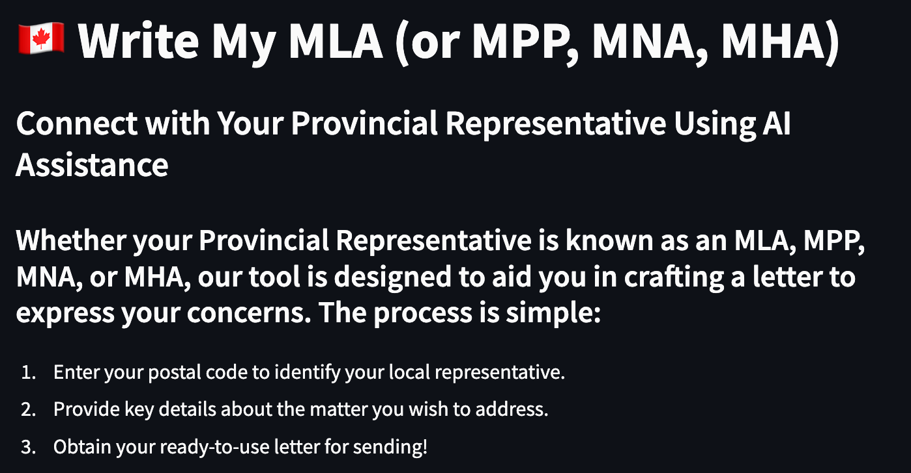

<a name="readme-top"></a>

[![LinkedIn][linkedin-shield]][linkedin-url]

<div align="center">
<h3 align="center">Write My MLA</h3>

  <p align="center">
    Helping Canadian Citizens write their MLA, MPP, MNA, or MHA using the power of AI.
    <br />
    <a href="https://github.com/brysonbest/writemymla"><strong>Explore the docs »</strong></a>
    <br />
    <br />
    <a href="https://github.com/brysonbest/writemymla">View Demo</a>
    ·
    <a href="https://github.com/brysonbest/writemymla/issues">Report Bug</a>
    ·
    <a href="https://github.com/brysonbest/writemymla/issues">Request Feature</a>
  </p>
</div>

<!-- TABLE OF CONTENTS -->
<details>
  <summary>Table of Contents</summary>
  <ol>
    <li>
      <a href="#about-the-project">About The Project</a>
      <ul>
        <li><a href="#built-with">Built With</a></li>
      </ul>
    </li>
    <li>
      <a href="#getting-started">Getting Started</a>
      <ul>
        <li><a href="#prerequisites">Prerequisites</a></li>
        <li><a href="#installation">Installation</a></li>
                <li><a href="#deployment">Deployment</a></li>
      </ul>
    </li>
    <li><a href="#usage">Usage</a></li>
    <li><a href="#roadmap">Roadmap</a></li>
    <li><a href="#contributing">Contributing</a></li>
    <li><a href="#license">License</a></li>
    <li><a href="#contact">Contact</a></li>
    <li><a href="#acknowledgments">Acknowledgments</a></li>
  </ol>
</details>

<!-- ABOUT THE PROJECT -->

## About The Project



Write My MLA is an application that helps Canadian citizens write their local MLA, MPP, MNA, or MHA. The application uses the postal code of the user to search for their representative, and then input the issue that they're experiencing. Their experience is sent to either the OpenAI api, or a local instance of the GPT4all api to generate a professional letter that can then be sent on to their local representative.

<p align="right">(<a href="#readme-top">back to top</a>)</p>

### Built With

This application was developed in Python and deployed on <a href="https://streamlit.io/">Streamlit.io</a> with the intention that it can be quickdly and easily re-deployed and re-used on this platform.

<p align="right">(<a href="#readme-top">back to top</a>)</p>

<!-- GETTING STARTED -->

## Getting Started

To get a local copy up and running follow these simple steps.

### Prerequisites

- <a href="https://pip.pypa.io/en/stable/installation/">pip</a>
  ```sh
  python get-pip.py
  pip install --upgrade openai
  pip install streamlit
  ```
- <a href="https://pypi.org/project/openai/">openai</a>
  ```sh
  pip install --upgrade openai
  ```
- <a href="https://docs.streamlit.io/library/get-started/installation">streamlit</a>
  ```sh
  pip install streamlit
  ```

### Installation

1. Get an API Key for openAI at https://platform.openai.com/account/api-keys
2. Clone the repo
   ```sh
   git clone https://github.com/brysonbest/writemymla.git
   ```
3. Create .streamlit/.secrets.toml folder and file in the root directory and add your API key

   ```sh
   mkdir .streamlit
   cd .streamlit
   touch .secrets.toml
   ```

   openai_key="your key here"

4. Local Deployment
   ```sh
   streamlit run writemymla.py
   ```

### Deployment

1. Create a streamlit.io account https://share.streamlit.io/signup
2. Deploy your application following the instructions at https://docs.streamlit.io/en/stable/deploy_streamlit_app.html

<p align="right">(<a href="#readme-top">back to top</a>)</p>

<!-- USAGE EXAMPLES -->

## Usage

Use this application to search for and write Canadian MLA's, MPP's, MNA's, or MHA's. The application will return the name, party, and contact information for the representative, and provide the user with the opportunity to create an AI-generated letter. This is a not-for-profit project intended to aid citizens with finding their representatives.

## Disclaimer

The application is not intended to be used for any other purpose. Information is not vetted prior to dissemination, and may be inaccurate. Please go to your provincial website for the most up-to-date information. The application is not affiliated with any government body. Any actions taken based on the information provided by this application are the sole responsibility of the user.

<p align="right">(<a href="#readme-top">back to top</a>)</p>

<!-- ROADMAP -->

## Roadmap

See the [open issues](https://github.com/brysonbest/writemymla/issues) for a full list of proposed features (and known issues).

<p align="right">(<a href="#readme-top">back to top</a>)</p>

<!-- CONTRIBUTING -->

## Contributing

Contributions are what make the open source community such an amazing place to learn, inspire, and create. Any contributions you make are **greatly appreciated**.

If you have a suggestion that would make this better, please fork the repo and create a pull request. You can also simply open an issue with the tag "enhancement".
Don't forget to give the project a star! Thanks again!

1. Fork the Project
2. Create your Feature Branch (`git checkout -b feature/AmazingFeature`)
3. Commit your Changes (`git commit -m 'Add some AmazingFeature'`)
4. Push to the Branch (`git push origin feature/AmazingFeature`)
5. Open a Pull Request

<p align="right">(<a href="#readme-top">back to top</a>)</p>

<!-- LICENSE -->

## License

Distributed under the MIT License. See `LICENSE.txt` for more information.

<p align="right">(<a href="#readme-top">back to top</a>)</p>

<!-- CONTACT -->

## Contact

Project Link: [https://github.com/brysonbest/writemymla](https://github.com/brysonbest/writemymla)

<p align="right">(<a href="#readme-top">back to top</a>)</p>

<!-- ACKNOWLEDGMENTS -->

## Acknowledgments

- [Geocoder.ca](https://geocoder.ca/) Provided the API used to accurately search using postal code information.
- [Represent Civic Information API](https://represent.opennorth.ca/) Provided the API used to search for representatives based on location.
- [OpenAI API](https://openai.com/) Provided the API used to generate letters based on user input details.
- [GPT4All API](https://gpt4all.io/index.html) provided an open-source alternative for letter generation based on the user details.

OpenAI Provides the letter generation based on the user details

<p align="right">(<a href="#readme-top">back to top</a>)</p>

<!-- MARKDOWN LINKS & IMAGES -->

[linkedin-shield]: https://img.shields.io/badge/-LinkedIn-black.svg?style=for-the-badge&logo=linkedin&colorB=555
[linkedin-url]: https://linkedin.com/in/bryson-best
